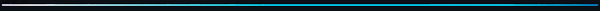

<!--
**theskinnyhippo/theskinnyhippo** is a ✨ _special_ ✨ repository because its `README.md` (this file) appears on your GitHub profile.

Here are some ideas to get you started:

- 🔭 I’m currently working on ...
- 🌱 I’m currently learning ...
- 👯 I’m looking to collaborate on ...
- 🤔 I’m looking for help with ...
- 💬 Ask me about ...
- 📫 How to reach me: ...
- 😄 Pronouns: ...
- ⚡ Fun fact: ...
-->

  

<h1 align="center">Hi there
, this is Mandir</h1>
<h3 align="center">a programmer-designer from India</h3>

  currently studying in 4th year of B.E.(IT) in Jadavpur University

  Interests : Graphics Designing, Web designing, web dev, data analysis.. and AI stuff!!!

<!--

 
   

-->

- 🌱 I’m currently learning **GUI based automations**
- 📫 How to reach me **mandirhapal1996@gmail.com**
- ⚡ **Melody khao Khud jan jao**

<h3 align="left">Languages and Tools:</h3>

  
  
  
  
  
  
  
  
  
  
  
  
  
  
  
  
  
  
  

  

  

&nbsp;
  

  

<h3 align="left">Connect with me:</h3>

  
  
  

